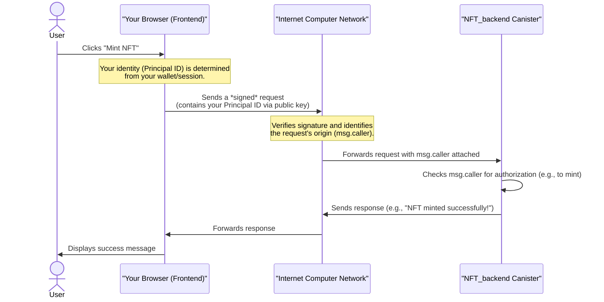

# Chapter 1: Principal ID (Identity)

Welcome to the exciting world of NFT marketplaces on the Internet Computer! Before we dive into smart contracts and digital art, let's start with a fundamental concept that underpins everything: the **Principal ID**.

Imagine you're at an exclusive art gallery opening (our NFT marketplace). How does the gallery know who you are? How do they verify if you own a ticket, or if you're allowed to bid on a painting? You'd likely show an ID or a specific ticket.

In the digital world of the Internet Computer, the **Principal ID** serves exactly this purpose. It's your secure, cryptographic ID card. Without it, the system wouldn't know who is trying to buy an NFT, who owns a specific digital collectible, or who is allowed to list their items for sale. It's crucial for proving **who** or **what** you are.

---

### What is a Principal ID?

A Principal ID is simply a **unique identifier** for any entity on the Internet Computer blockchain. Think of it as a digital fingerprint that distinguishes one participant from another.

This "entity" can be:

1.  **A User**: This is your unique identity when you interact with a decentralized application (dApp) like our NFT marketplace. It's like your secure wallet address.
2.  **A Smart Contract (Canister)**: Even smart contracts themselves have unique Principal IDs! This allows them to interact with other contracts and perform actions on the network.
3.  **An Anonymous Session**: In some cases, a temporary, anonymous ID can be generated for very basic interactions, though for an NFT marketplace, users typically have persistent IDs.

A Principal ID looks like a string of letters and numbers, often separated by hyphens, such as `2vxsx-fae` or `ryjl3-tyaaa-aaaaa-aaaba-cai`. While they might look complex, their purpose is straightforward: to uniquely identify.

---

### Principal IDs in Our NFT Marketplace

Let's see how Principal IDs are used in our NFT marketplace project. The core use case here is **identification** and **authorization**.

#### 1. Identifying the Current User (Frontend)

When you visit our NFT marketplace, the website needs to know who *you* are. This allows it to show you your own NFTs, or to make sure you can only sell NFTs that you truly own.

In our frontend code, we use a placeholder `CURRENT_USER_ID` for demonstration purposes. In a full, deployed dApp, your actual Principal ID would be securely obtained from your cryptographic wallet (like Internet Identity) when you log in.

Let's look at how we define this ID:

```jsx
// --- File: src/NFT_frontend/components/index.jsx ---
import React from 'react'
import { Principal } from '@dfinity/principal' // Imports the Principal type

const CURRENT_USER_ID = Principal.fromText("2vxsx-fae"); // Our placeholder user ID
export default CURRENT_USER_ID;
```

This tiny snippet does two important things:
1.  It imports the `Principal` type from the `@dfinity/principal` library, which helps us work with Principal IDs in JavaScript.
2.  It creates a `Principal` object from a text string `"2vxsx-fae"` and assigns it to `CURRENT_USER_ID`. This is now the "identity" of the user interacting with the frontend.

Now, let's see how this `CURRENT_USER_ID` is used to decide what buttons you see:

```jsx
// --- File: src/NFT_frontend/components/Item.jsx ---
// ... (other imports and state definitions) ...
import CURRENT_USER_ID from "."; // Importing our placeholder user ID

function Item(props) {
  // ... (other logic) ...

  async function loadNFT() {
    // ... (fetching NFT data) ...

    else if (props.role == "discover"){
      // Get the original owner of the NFT from the backend
      const originalOwner = await NFT_backend.getOriginalOwner(props.id);

      // Check if the original owner is NOT the current user
      if(originalOwner.toText() != CURRENT_USER_ID.toText()){
        // If not, show a "Buy" button
        setButton(<Button handleClick={handleBuy} text={"Buy"} />);
      }
      // ... (rest of the discover logic) ...
    }
    // ... (rest of loadNFT) ...
  };

  // ... (rest of Item component) ...
}
export default Item;
```

In this `Item.jsx` code, when displaying an NFT in the "discover" section, the application fetches the `originalOwner` of that NFT. It then compares this owner's Principal ID (`originalOwner.toText()`) with our `CURRENT_USER_ID`. If they are *different*, it means you, the current user, don't own this NFT, so a "Buy" button is displayed! This simple comparison, powered by Principal IDs, is fundamental for marketplace logic.

#### 2. Identifying the Caller (Backend/Smart Contracts)

On the Internet Computer, smart contracts (called [ICP Canisters (Smart Contracts)](02_icp_canisters__smart_contracts__.md)) are programs that run on the blockchain. When you interact with these contracts (e.g., by clicking "Mint NFT" or "Sell NFT"), the contract needs to know *who* initiated that action. This "who" is identified by a Principal ID.

Inside a Motoko smart contract, the `msg.caller` variable holds the Principal ID of the entity that invoked the current function.

Let's see this in our `NFT_backend` canister (which handles marketplace logic):

```motoko
// --- File: src/NFT_backend/main.mo ---
import Principal "mo:base/Principal"; // Imports the Principal type

actor NftMarketPlace {
  // ... (other code) ...

  // Function to mint a new NFT
  public shared (msg) func mint(imgData : [Nat8], name : Text) : async Principal {
    let owner : Principal = msg.caller; // The Principal ID of the caller becomes the NFT owner
    // ... (rest of mint function) ...
  };

  // Function to list an NFT for sale
  public shared(msg) func listItem(id: Principal, price: Nat): async Text{
    // ... (fetch NFT details) ...
    let owner =await item.getOwner(); // Get the current owner of the NFT
    if (Principal.equal(owner, msg.caller)){ // Check if the caller is the actual owner
      // ... (proceed with listing) ...
    }else{
      return "You do not own this NFT"; // If not, deny the action
    };
    // ... (rest of listItem function) ...
  };
  // ... (rest of NftMarketPlace actor) ...
};
```

Here:
*   In the `mint` function, `msg.caller` is used to directly assign ownership of the newly minted NFT to the user who called the `mint` function. This proves that *you* were the one who minted it.
*   In the `listItem` function, before an NFT can be listed, the contract checks if the `msg.caller` (the person trying to list the NFT) is the same as the NFT's current `owner`. This is a crucial security check using Principal IDs to ensure only the rightful owner can list an item for sale.

Similarly, our individual NFT smart contracts also use `msg.caller` for security:

```motoko
// --- File: src/Canister/canister.mo ---
import Principal "mo:base/Principal"; // Imports the Principal type

actor class NFT(name : Text, owner : Principal, content : [Nat8]) = this {
  // ... (other properties) ...
  private var nftOwner = owner; // Stores the current owner's Principal ID

  // Function to transfer NFT ownership
  public shared(msg) func transferOwnerShip(newOwner: Principal) : async Text{
    if(msg.caller == nftOwner){ // Check if the caller is the current owner
      nftOwner := newOwner; // If yes, update the owner
      return "Success";
    }else{
      return "Error: Not initiated by  NFT owner" // If not, deny the action
    };
  };
};
```

This `transferOwnerShip` function is critical. When an NFT is bought or listed, its ownership changes. This function ensures that *only* the current `nftOwner` can authorize a transfer. If `msg.caller` (the ID of whoever is trying to transfer) doesn't match `nftOwner`, the transfer is rejected.

---

### How Principal IDs Work (Under the Hood)

Let's quickly visualize what happens when you interact with the marketplace, focusing on how your Principal ID is identified:



Essentially, your Principal ID is cryptographically linked to your actions. When your browser sends a request to the Internet Computer, it's like sending an email with a digital signature. The Internet Computer network verifies this signature and knows exactly "who" sent the request. This "who" is then passed as `msg.caller` to the smart contract, allowing it to apply its logic securely.

---

### Conclusion

Principal IDs are the bedrock of identity and security on the Internet Computer. They allow our NFT marketplace to uniquely identify users and smart contracts, verify ownership, and authorize actions like minting, listing, and transferring NFTs. They are the digital ID cards that make our decentralized world secure and functional.

Now that you understand *who* is interacting with our dApp, let's move on to understand *what* they are interacting with: the smart contracts themselves!

[ICP Canisters (Smart Contracts)](02_icp_canisters__smart_contracts__.md)

---
