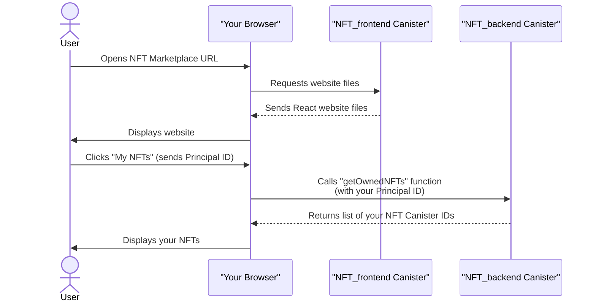

# Chapter 2: ICP Canisters (Smart Contracts)

In the previous chapter, we learned about your digital identity on the Internet Computer, the [Principal ID (Identity)](01_principal_id__identity__.md), which tells us *who* is interacting with our NFT marketplace. Now, let's explore *what* those Principal IDs are interacting with: **ICP Canisters**, often called "smart contracts."

Imagine our NFT marketplace as a bustling city. You, with your Principal ID, are a citizen. But what are the buildings, shops, and services in this city? They are all powered by **canisters**.

On traditional websites, you have a website (frontend) and a server (backend) that stores data and runs logic. On the Internet Computer, all of these parts – the website you see, the marketplace's rules, and even each individual NFT – are special types of programs called **canisters** that run directly on the blockchain.

### What is an ICP Canister?

Think of a canister as a powerful, self-contained mini-application or a small, independent web server and database, all rolled into one. Here are its key features:

*   **Self-Contained Program**: Each canister has its own code (the instructions it follows), its own data (what it remembers), and its own memory. It's like a tiny computer program running on the blockchain.
*   **Runs on the Blockchain**: Unlike regular servers that run in data centers, canisters run directly on the Internet Computer blockchain. This makes them decentralized, secure, and tamper-proof.
*   **Independent but Communicative**: Canisters are independent, meaning they can perform their tasks without relying on external servers. However, they can also securely talk to each other to build more complex applications, just like different services in a city might interact.
*   **The "Everything" of ICP**: On the Internet Computer, almost *everything* is a canister. Your website's frontend (what you see), the backend logic for the marketplace (how NFTs are bought and sold), and even individual NFTs themselves are all separate canisters.

### Canisters in Our NFT Marketplace

Our NFT marketplace project perfectly illustrates the power of canisters:

1.  **The Frontend Canister**: This is the website you interact with. It's a canister that serves the React code, images, and other assets directly from the blockchain to your browser. No separate web hosting needed!
2.  **The Backend Canister (`NFT_backend`)**: This canister holds the core logic of our marketplace. It remembers which NFTs are for sale, their prices, and who owns what. When you click "Mint" or "Buy," this canister handles those actions. This is our [NFT_backend Canister (Marketplace Logic)](04_nft_backend_canister__marketplace_logic__.md).
3.  **Individual NFT Canisters (`Canister`)**: This is a unique feature! Instead of just a record in a database, *each individual NFT is its own smart contract (canister)*. This canister holds the NFT's unique image, name, and current owner, and it has the logic to transfer ownership when sold. This is our [NFT Actor Class (Individual NFT Canister)](03_nft_actor_class__individual_nft_canister__.md).

This "everything is a canister" approach allows our entire NFT marketplace to be fully decentralized and live entirely on the Internet Computer blockchain, from the pixel you see to the transaction that records ownership.

### How Canisters Interact (High-Level)

Let's see a simple flow of how canisters might interact when a user wants to view their NFTs:



In this diagram, the browser first gets the website files from the `NFT_frontend` canister. Then, when you ask to see your NFTs, the frontend canister tells the `NFT_backend` canister (sending your [Principal ID (Identity)](01_principal_id__identity__.md) as `msg.caller`) to fetch the list of NFTs you own. This is a basic example of **inter-canister communication**, which we'll cover in more detail later.

### Defining Canisters with `dfx.json`

The Internet Computer SDK, `dfx`, uses a special file called `dfx.json` to define all the canisters that make up your project. This file tells `dfx` what code belongs to which canister and how to build them.

Here's a simplified look at how our marketplace's main canisters are defined in `dfx.json`:

```json
// --- File: dfx.json (simplified) ---
{
  "canisters": {
    "NFT_backend": {
      "main": "src/NFT_backend/main.mo",
      "type": "motoko"
    },
    "Canister":{
      "main": "src/Canister/canister.mo",
      "type": "motoko"
    },
    "NFT_frontend": {
      "dependencies": [
        "NFT_backend"
      ],
      "source": [
        "src/NFT_frontend/dist"
      ],
      "type": "assets",
      "workspace": "NFT_frontend"
    }
  },
  // ... (other configurations) ...
}
```

Let's break down these definitions:

1.  **`NFT_backend` Canister**:
    ```json
    "NFT_backend": {
      "main": "src/NFT_backend/main.mo",
      "type": "motoko"
    },
    ```
    *   `"NFT_backend"`: This is the name we give to our marketplace's backend canister.
    *   `"main": "src/NFT_backend/main.mo"`: This tells `dfx` that the code for this canister is located in the `main.mo` file (where `.mo` stands for Motoko, our smart contract language).
    *   `"type": "motoko"`: This crucial line instructs `dfx` to compile this code using the Motoko compiler, turning it into a program that can run on the Internet Computer.

2.  **`Canister` (NFT Blueprint) Canister**:
    ```json
    "Canister":{
      "main": "src/Canister/canister.mo",
      "type": "motoko"
    },
    ```
    *   `"Canister"`: This might seem confusing, as it's a generic name. In our project, this entry in `dfx.json` acts as the *blueprint* or *template* for every individual NFT. When `NFT_backend` wants to "mint" a new NFT, it uses this `canister.mo` code to create a brand new, unique NFT canister on the fly.
    *   `"main": "src/Canister/canister.mo"`: Points to the Motoko code that defines what an individual NFT does.
    *   `"type": "motoko"`: Again, `dfx` compiles this Motoko code.

3.  **`NFT_frontend` Canister**:
    ```json
    "NFT_frontend": {
      "dependencies": [
        "NFT_backend"
      ],
      "source": [
        "src/NFT_frontend/dist"
      ],
      "type": "assets",
      "workspace": "NFT_frontend"
    }
    ```
    *   `"NFT_frontend"`: This is the name for our user-facing website.
    *   `"dependencies": ["NFT_backend"]`: This tells `dfx` that our frontend needs to know about `NFT_backend` to interact with it. `dfx` will make sure `NFT_backend` is deployed first and generate necessary code to allow communication.
    *   `"source": ["src/NFT_frontend/dist"]`: This specifies where `dfx` can find the compiled (built) files of our React application.
    *   `"type": "assets"`: This tells `dfx` that this canister doesn't contain Motoko smart contract code, but rather static files (like HTML, CSS, JavaScript, images) that should be served directly to users' browsers. It's like a decentralized web server.

### Conclusion

ICP Canisters are the fundamental building blocks of applications on the Internet Computer. They are self-contained, blockchain-based programs that can represent anything from your website's frontend to complex backend logic and even individual digital assets like NFTs. Understanding canisters is key to grasping how our NFT marketplace operates entirely on-chain.

Now that we know what canisters are, let's dive into one of the most exciting aspects of our project: how each individual NFT itself is a specialized canister!

[NFT Actor Class (Individual NFT Canister)](03_nft_actor_class__individual_nft_canister__.md)

---