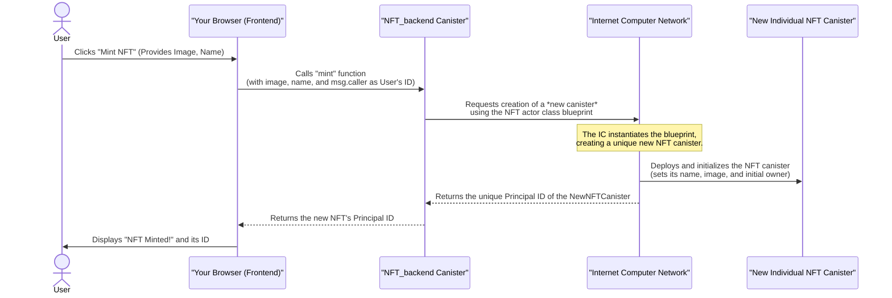

# Chapter 3: NFT Actor Class (Individual NFT Canister)

In the previous chapter, [ICP Canisters (Smart Contracts)](02_icp_canisters__smart_contracts__.md), we learned that canisters are the fundamental building blocks on the Internet Computer, acting as self-contained programs with their own code and data. Now, let's dive into one of the most unique and powerful aspects of building an NFT marketplace on the Internet Computer: how *each individual NFT* is itself a dedicated canister!

Imagine you have a collection of very valuable, one-of-a-kind digital art pieces. On most traditional platforms, all these art pieces might be listed in one big spreadsheet or ledger managed by a single central smart contract. While functional, it's like having all your precious artworks stored in one massive vault, with a central manager deciding who owns what.

On the Internet Computer, we take a different approach. Instead of a single manager, **each individual NFT is its own unique digital safe deposit box**. This "safe deposit box" is a dedicated canister, meaning it's a completely independent smart contract with its own identity, data, and rules. This offers unparalleled decentralization and security for your digital assets.

---

### What is an NFT Actor Class?

At its core, an "NFT Actor Class" is like a **blueprint** or a **factory** for creating these individual NFT canisters.

In Motoko (the language we use for smart contracts), `actor class` allows us to define a template. When we "mint" a new NFT, we use this template to create a brand new, unique instance of an NFT canister, complete with its own unique identifier (a [Principal ID (Identity)](01_principal_id__identity__.md)).

Think of it like this:

*   **NFT Actor Class:** The design plans for a specific model of safe deposit box (e.g., "Standard Art Safe Model X").
*   **Individual NFT Canister:** An actual, physical safe deposit box built according to those plans. Each one is a separate, distinct box with its own lock and contents.

This is a significant difference from many other blockchains:

| Feature           | Internet Computer NFTs (Individual Canisters)                       | Other Blockchains (e.g., ERC-721)                          |
| :---------------- | :------------------------------------------------------------------ | :--------------------------------------------------------- |
| **Structure**     | Each NFT is its own smart contract (canister).                      | Many NFTs are managed by a single, central smart contract. |
| **Data Storage**  | NFT's image and metadata stored directly *on-chain* within its canister. | Often stores only a link (URL) to off-chain data.          |
| **Ownership**     | Ownership logic handled by the NFT's own canister.                  | Ownership managed by the central contract's ledger.        |
| **Flexibility**   | Each NFT can have unique logic/features if designed.                | All NFTs under one contract share the same logic.          |

---

### Anatomy of an Individual NFT Canister

Each NFT canister, created from our `NFT` actor class blueprint, holds all the essential information and functionality for that specific digital asset:

1.  **Data (What it holds):**
    *   **Name:** The title of the NFT (e.g., "Sunset over Cyberpunk City").
    *   **Image Data:** Crucially, the raw image bytes are stored *directly inside this canister*, on-chain! This means your NFT's visual content is permanently and immutably part of the blockchain, not relying on external websites.
    *   **Current Owner:** The [Principal ID (Identity)](01_principal_id__identity__.md) of the person or entity who currently owns this specific NFT.

2.  **Methods (What it can do):**
    *   **Query Information:** Functions to ask the NFT canister for its name, its image data, or its current owner.
    *   **Transfer Ownership:** A secure method to change the `nftOwner` to a new [Principal ID (Identity)](01_principal_id__identity__.md).

Let's look at the simplified code for our `NFT` actor class, found in `src/Canister/canister.mo`:

```motoko
// --- File: src/Canister/canister.mo (Simplified) ---
import Text "mo:base/Text";
import Principal "mo:base/Principal";

actor class NFT(name : Text, owner : Principal, content : [Nat8]) = this {
  // These are the private variables that store the NFT's unique data
  private let itemName = name;
  private var nftOwner = owner; // 'var' means it can change (when transferred)
  private let imageBytes = content; // Raw image data stored on-chain!

  // Public functions to query the NFT's data
  public query func getName() : async Text { return itemName; };
  public query func getOwner() : async Principal { return nftOwner; };
  public query func getAsset() : async [Nat8] { return imageBytes; };

  // Public function to transfer ownership (more on this below!)
  public shared(msg) func transferOwnerShip(newOwner: Principal) : async Text {
    // ... (logic to check if msg.caller is the current owner) ...
    // ... (if authorized, nftOwner := newOwner) ...
    return "Success";
  };
  // ... (other helper functions) ...
};
```

In this code:
*   `actor class NFT(...)` declares our blueprint. The values `name`, `owner`, and `content` are provided *when a new NFT canister is created*.
*   `itemName`, `nftOwner`, and `imageBytes` are the internal "state" of *each individual NFT canister*.
*   `getName()`, `getOwner()`, and `getAsset()` are the ways other canisters or the frontend can ask this specific NFT canister for its unique details.

---

### Using an Individual NFT Canister (Displaying an NFT)

Let's see how our frontend (`NFT_frontend`) interacts directly with these individual NFT canisters to display an NFT's details in the marketplace.

When you view an NFT, our frontend needs to know which specific NFT canister to talk to. It does this using the unique [Principal ID (Identity)](01_principal_id__identity__.md) of that NFT canister.

Here's how `src/NFT_frontend/components/Item.jsx` fetches and displays an NFT's data:

```jsx
// --- File: src/NFT_frontend/components/Item.jsx (Simplified) ---
import React, { useEffect, useState } from "react";
import { Actor, HttpAgent } from "@dfinity/agent";
import { idlFactory } from "../../declarations/Canister"; // IDL for our NFT blueprint

function Item(props) {
  const [name, setName] = useState("");
  const [owner, setOwner] = useState("");
  const [imageData, setImageData] = useState();

  // The 'props.id' is the unique Principal ID of THIS specific NFT canister
  const id = props.id;
  const host = "http://127.0.0.1:3000"; // Our local Internet Computer replica
  const agent = new HttpAgent({ host, disableCertificateVerification: true });

  let NFTActor; // This will hold our "actor" to interact with the NFT canister

  async function loadNFT() {
    await agent.fetchRootKey(); // Needed for local development
    // 1. Create an 'Actor' to communicate with the specific NFT canister
    NFTActor = Actor.createActor(idlFactory, {
      agent,
      canisterId: id, // We tell it *which* specific NFT canister ID to talk to
    });

    // 2. Call the public methods on that NFT canister to get its data
    const nameData = await NFTActor.getName();
    const ownerData = await NFTActor.getOwner();
    const assetData = await NFTActor.getAsset();

    // 3. Process and set the state to display the data
    const imageContent = new Uint8Array(assetData);
    const image = URL.createObjectURL(new Blob([imageContent.buffer], { type: "image/png" }));

    setName(nameData);
    setOwner(ownerData.toText());
    setImageData(image);
  }

  // Call loadNFT when the component loads
  useEffect(() => { loadNFT(); }, []);

  return (
    <div className="disGrid-item">
      {/* ... Display name, owner, and image ... */}
      
      <h2>{name}</h2>
      <p>Owner: {owner}</p>
    </div>
  );
}
export default Item;
```

Here's what's happening:
1.  `Actor.createActor(idlFactory, { agent, canisterId: id });` is the magic. It creates a special client (an "actor") that knows how to communicate with *one specific canister*, identified by `canisterId`. `idlFactory` tells it what functions that canister has.
2.  Once `NFTActor` is created, you can simply call its methods like `NFTActor.getName()` or `NFTActor.getOwner()`. The frontend doesn't need to know *where* these values are stored; it just asks the individual NFT canister, and the canister provides its unique data.

---

### How are Individual NFT Canisters Created? (Minting)

So, if each NFT is its own canister, how do these new canisters come into existence? The answer lies with our marketplace's backend canister, `NFT_backend`. When a user "mints" a new NFT, the `NFT_backend` dynamically creates a new NFT canister using our `NFT` actor class blueprint.

Here's a simplified flow for minting an NFT:



Now, let's look at the `mint` function in `src/NFT_backend/main.mo`:

```motoko
// --- File: src/NFT_backend/main.mo (Simplified) ---
import Principal "mo:base/Principal";
import NFTActorClass "../Canister/canister"; // Import the NFT blueprint

actor NftMarketPlace {
  // ... (other variables for marketplace logic) ...

  // This function mints a new NFT
  public shared (msg) func mint(imgData : [Nat8], name : Text) : async Principal {
    let owner : Principal = msg.caller; // The user who called 'mint' is the first owner

    // This is the key line: creating a new NFT canister instance
    let newNFT = await NFTActorClass.NFT(name, owner, imgData);

    // Get the unique Principal ID of this newly created NFT canister
    let newNFTPrincipal = await newNFT.getCanisterId();

    // Store this new NFT's ID in the marketplace's data
    // (e.g., in a list of NFTs owned by the 'owner' Principal ID)
    // mapOfNFTs.put(newNFTPrincipal, newNFT);
    // addToOwnerShipMap(owner, newNFTPrincipal);

    return newNFTPrincipal; // Return the ID of the new, unique NFT canister
  };
  // ... (other marketplace functions) ...
};
```

When `NFTActorClass.NFT(name, owner, imgData)` is called within the `mint` function, it's not just creating a data entry; it's instructing the Internet Computer to literally launch a brand new, independent canister on the blockchain, initialized with the provided name, owner, and image data. This new canister then gets its own unique Principal ID!

---

### Transferring Ownership (Security in Each NFT)

One of the most powerful aspects of an individual NFT canister is that it can manage its own ownership logic. This means that transferring an NFT isn't just an update in a central ledger; it's a direct command to the NFT's own smart contract.

Consider the `transferOwnerShip` function within `src/Canister/canister.mo`:

```motoko
// --- File: src/Canister/canister.mo (Simplified) ---
import Principal "mo:base/Principal";

actor class NFT(name : Text, owner : Principal, content : [Nat8]) = this {
  // ...
  private var nftOwner = owner; // Stores the current owner's Principal ID

  // This function allows transferring ownership of THIS specific NFT
  public shared(msg) func transferOwnerShip(newOwner: Principal) : async Text{
    // Crucial security check!
    // msg.caller (from Chapter 1) is the ID of the entity calling this function.
    if(msg.caller == nftOwner){ // Is the person trying to transfer the actual owner?
      nftOwner := newOwner; // If yes, update the owner variable within this canister
      return "Success";
    }else{
      return "Error: Not initiated by  NFT owner" // If not, reject the action
    };
  };
};
```

This simple `if(msg.caller == nftOwner)` check is incredibly important. It ensures that *only* the current legitimate owner of that specific NFT canister (identified by their [Principal ID (Identity)](01_principal_id__identity__.md)) can initiate a transfer of ownership for *that specific NFT*. This self-contained security is a hallmark of the Internet Computer's approach to NFTs.

---

### Conclusion

The "NFT Actor Class" is a foundational concept on the Internet Computer, representing a blueprint for creating truly decentralized digital assets. By making each NFT an individual canister, we ensure that every NFT has its own dedicated on-chain storage for its content and its own immutable logic for managing ownership. This provides an unparalleled level of security, autonomy, and transparency for digital collectibles.

Now that we understand how individual NFTs are structured and managed, let's explore how our `NFT_backend` canister orchestrates the marketplace, managing these individual NFTs for buying, selling, and discovery.

[NFT_backend Canister (Marketplace Logic)](04_nft_backend_canister__marketplace_logic_.md)

---