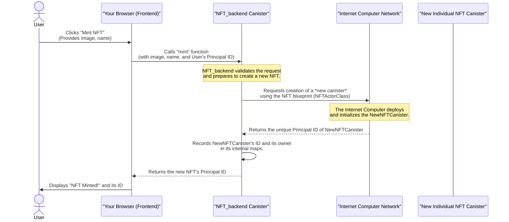
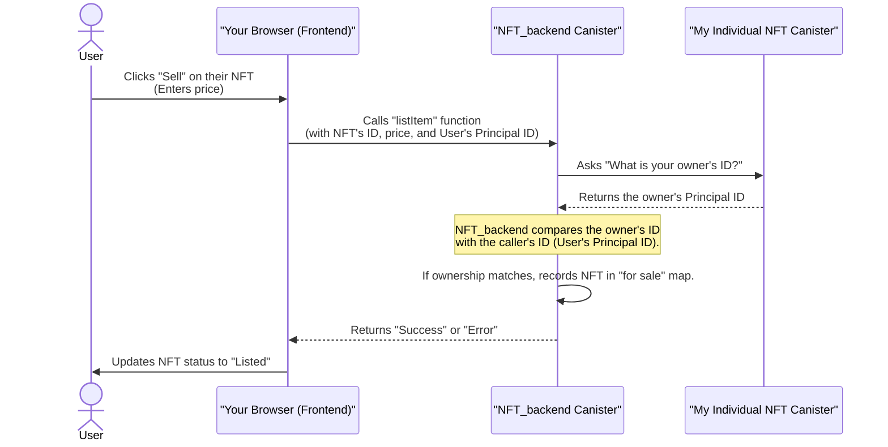

# Chapter 4: NFT_backend Canister (Marketplace Logic)

In the previous chapter, [NFT Actor Class (Individual NFT Canister)](03_nft_actor_class__individual_nft_canister__.md), we discovered the exciting concept that each individual NFT on the Internet Computer is its own self-contained smart contract, a dedicated canister. This gives each NFT unparalleled autonomy and security.

But here's a question: If every NFT is a separate digital safe deposit box, how do we find them all? How do we know which ones are for sale? How do we coordinate a purchase where money changes hands and ownership is transferred? We need a central "administrative office" or a "marketplace coordinator" that knows about *all* the NFTs and manages the overall buying and selling process.

This is precisely the role of the **`NFT_backend` canister**.

Imagine our NFT marketplace as a large, vibrant art gallery. Each unique painting (an individual NFT canister) has its own little display. But you don't just wander aimlessly hoping to find a painting for sale. You go to the gallery's front desk or administrative office. This office:
*   Registers new paintings (mints new NFTs).
*   Keeps a catalog of all paintings and their owners.
*   Takes requests from owners who want to list their paintings for sale.
*   Handles the paperwork when a painting is bought, ensuring the new owner gets the painting and the seller gets paid.

The `NFT_backend` canister is exactly this administrative office for our digital art gallery. It's the central smart contract that orchestrates the entire marketplace logic.

---

### What is the `NFT_backend` Canister?

The `NFT_backend` canister is the **heart of our NFT marketplace**. It's a single, powerful smart contract (a canister, as we learned in [ICP Canisters (Smart Contracts)](02_icp_canisters__smart_contracts__.md)) that holds the overall marketplace rules, tracks all the NFTs, and facilitates their transactions.

Here are its key responsibilities:

1.  **Minting New NFTs**: When a user wants to create a new NFT, the `NFT_backend` is the one that triggers the creation of a brand new [NFT Actor Class (Individual NFT Canister)](03_nft_actor_class__individual_nft_canister__.md).
2.  **Tracking Ownership**: It keeps a record of which user ([Principal ID (Identity)](01_principal_id__identity__.md)) owns which NFT canister.
3.  **Listing NFTs for Sale**: It maintains a list of all NFTs that are currently available for purchase and their prices.
4.  **Facilitating Purchases**: When someone buys an NFT, the `NFT_backend` coordinates the transfer of ownership of the individual NFT canister and, in a real marketplace, would also handle the payment.
5.  **Discovery**: It allows users to browse all NFTs in the marketplace, whether owned by them or listed for sale.

When you interact with the marketplace (e.g., click "Mint NFT" or "List for Sale"), your frontend application (the website in your browser) is communicating directly with this `NFT_backend` canister.

---

### Defining the `NFT_backend` Canister

Like all canisters in our project, the `NFT_backend` is defined in the `dfx.json` file. This tells the Internet Computer Development Kit (`dfx`) about our marketplace's central brain.

```json
// --- File: dfx.json (simplified) ---
{
  "canisters": {
    "NFT_backend": { // Our marketplace backend
      "main": "src/NFT_backend/main.mo", // Points to its Motoko code
      "type": "motoko"
    },
    // ... (other canisters like "Canister" for individual NFTs, "NFT_frontend") ...
  },
  // ...
}
```

This snippet simply states that we have a canister named `NFT_backend`, and its core logic is written in the Motoko file `src/NFT_backend/main.mo`.

---

### Core Logic of `NFT_backend`

Let's look at the essential functions within `src/NFT_backend/main.mo` that enable the marketplace's operations.

#### 1. Minting a New NFT

When a user wants to create a new NFT, they interact with the `mint` function on the `NFT_backend` canister. This function doesn't *create* the NFT itself; it tells the Internet Computer to create a *new instance* of the [NFT Actor Class (Individual NFT Canister)](03_nft_actor_class__individual_nft_canister__.md).

```motoko
// --- File: src/NFT_backend/main.mo (Simplified) ---
import Principal "mo:base/Principal";
import NFTActorClass "../Canister/canister"; // Import the NFT blueprint

actor NftMarketPlace {
  // HashMaps are like Python dictionaries or JavaScript objects
  // They store key-value pairs
  var mapOfNFTs = HashMap.HashMap<Principal, NFTActorClass.NFT>(1, Principal.equal, Principal.hash);
  var mapOfOwners = HashMap.HashMap<Principal, List.List<Principal>>(1, Principal.equal, Principal.hash);

  // Function to mint a new NFT
  public shared (msg) func mint(imgData : [Nat8], name : Text) : async Principal {
    let owner : Principal = msg.caller; // The user who called 'mint' (from Chapter 1)

    // This is the key line: create a NEW NFT canister from its blueprint!
    let newNFT = await NFTActorClass.NFT(name, owner, imgData);

    // Get the unique Principal ID of this newly created NFT canister
    let newNFTPrincipal = await newNFT.getCanisterId();

    // Store a reference to the new NFT canister and update ownership records
    mapOfNFTs.put(newNFTPrincipal, newNFT);
    addToOwnerShipMap(owner, newNFTPrincipal); // More on this next

    return newNFTPrincipal; // Return the ID of the new, unique NFT canister
  };
  // ... (other functions) ...
};
```
**Explanation:**
*   The `mint` function takes the `imgData` and `name` for the new NFT.
*   `msg.caller` (from [Principal ID (Identity)](01_principal_id__identity__.md)) automatically identifies the user who is minting the NFT, making them the initial `owner`.
*   `await NFTActorClass.NFT(name, owner, imgData);` is the crucial step. It instructs the Internet Computer to deploy a *brand new canister* using the `NFT` actor class blueprint, initializing it with the provided details.
*   The `NFT_backend` then gets the unique [Principal ID (Identity)](01_principal_id__identity__.md) of this newly created NFT canister and stores it in its `mapOfNFTs` and `mapOfOwners` for tracking.

#### 2. Tracking NFT Ownership

The `NFT_backend` needs to know which user owns which NFTs. This is managed using a `HashMap` called `mapOfOwners`.

```motoko
// --- File: src/NFT_backend/main.mo (Simplified) ---
// ... (imports and other HashMap definitions) ...

actor NftMarketPlace {
  // ... (mapOfNFTs definition) ...
  // Stores a Principal (user ID) mapped to a list of NFT Principal IDs they own
  var mapOfOwners = HashMap.HashMap<Principal, List.List<Principal>>(1, Principal.equal, Principal.hash);

  // Helper function to add an NFT to a user's ownership list
  private func addToOwnerShipMap(owner : Principal, nftId : Principal) {
    // Get the current list of NFTs for this owner, or an empty list if new
    var ownedNFTs : List.List<Principal> = switch (mapOfOwners.get(owner)) {
      case null List.nil<Principal>();
      case (?result) result;
    };
    ownedNFTs := List.push(nftId, ownedNFTs); // Add the new NFT ID to the list
    mapOfOwners.put(owner, ownedNFTs); // Update the map
  };

  // Public function to get all NFTs owned by a specific user
  public query func getOwnedNFTs(user: Principal):async [Principal]{
    // Retrieve the list of NFT IDs for the given user
    var userNFTs: List.List<Principal> = switch (mapOfOwners.get(user)) {
      case null List.nil<Principal>();
      case (?result) result;
    };
    return List.toArray(userNFTs); // Return them as an array
  };
  // ... (other functions) ...
};
```
**Explanation:**
*   `addToOwnerShipMap` is called whenever an NFT is minted (or bought), linking the NFT's [Principal ID (Identity)](01_principal_id__identity__.md) to its `owner`.
*   `getOwnedNFTs` is used by the frontend to display all NFTs belonging to a particular `user` (identified by their [Principal ID (Identity)](01_principal_id__identity__.md)).

#### 3. Listing NFTs for Sale

To put an NFT up for sale, a user calls the `listItem` function on the `NFT_backend`.

```motoko
// --- File: src/NFT_backend/main.mo (Simplified) ---
// ... (imports and other HashMap definitions) ...

actor NftMarketPlace {
  // ... (mapOfNFTs, mapOfOwners definitions) ...

  // Defines the structure for a listing
  private type Listing = {
    itemOwner: Principal; // The original owner
    itemPrice: Nat;       // The price of the NFT
  };
  // Stores NFT Principal ID mapped to its listing details
  var mapOfListings = HashMap.HashMap<Principal, Listing>(1, Principal.equal, Principal.hash);

  public shared(msg) func listItem(id: Principal, price: Nat): async Text{
    // 1. Get a reference to the actual NFT canister
    var item: NFTActorClass.NFT = switch (mapOfNFTs.get(id)){
      case null return "NFT does not exists";
      case (?result) result;
    };

    // 2. IMPORTANT: Verify the caller (msg.caller) is the actual owner of the NFT!
    let owner =await item.getOwner(); // Ask the individual NFT canister for its owner
    if (Principal.equal(owner, msg.caller)){
      // 3. If authorized, create a new listing entry
      let newListing: Listing={
        itemOwner = owner;
        itemPrice = price;
      };
      mapOfListings.put(id, newListing); // Store the listing in the marketplace
      return "Success";
    }else{
      return "You do not own this NFT"; // Deny if not the owner
    };
  };

  // Public function to get all NFT IDs that are currently listed for sale
  public query func getListedNFTIds(): async [Principal]{
   let ids = Iter.toArray(mapOfListings.keys()); // Get all keys (NFT IDs) from the listings map
   return ids;
  };

  // Public function to check if a specific NFT is listed
  public query func isListed (id: Principal):async Bool{
    return mapOfListings.get(id) != null;
  };
  // ... (other functions) ...
};
```
**Explanation:**
*   The `listItem` function takes the `id` (Principal ID) of the NFT to list and its `price`.
*   It first retrieves the specific [NFT Actor Class (Individual NFT Canister)](03_nft_actor_class__individual_nft_canister__.md) using `mapOfNFTs.get(id)`.
*   Crucially, it asks the *individual NFT canister* itself for its current `owner` (`await item.getOwner()`).
*   It then compares this `owner` with `msg.caller` (the [Principal ID (Identity)](01_principal_id__identity__.md) of the user trying to list the NFT). This ensures **only the true owner can list an NFT for sale**.
*   If the check passes, the NFT's `id` and `price` are added to the `mapOfListings`.
*   `getListedNFTIds` and `isListed` are used by the frontend to display available NFTs and check their status.

---

### How the `NFT_backend` Coordinates Actions

Let's visualize how the `NFT_backend` acts as the central coordinator for the marketplace.

#### Example 1: Minting an NFT


**Explanation:** The user tells the `Browser` to mint. The `Browser` sends this request to the `BackendCanister`. The `BackendCanister` then acts as an intermediary, instructing the `InternetComputer` to *create a brand new* [NFT Actor Class (Individual NFT Canister)](03_nft_actor_class__individual_nft_canister__.md). Once created, the `NFT_backend` receives its ID, records it, and returns it to the user.

#### Example 2: Listing an NFT for Sale


**Explanation:** When listing an NFT, the `NFT_backend` doesn't just trust the user. It performs a vital security check by communicating with the *individual NFT canister* (`MyNFTCanister`) to confirm the caller's ([Principal ID (Identity)](01_principal_id__identity__.md)) right to list. This highlights **inter-canister communication**, which we'll cover in detail in the next chapter!

---

### `NFT_backend` in the Frontend Code

Our frontend (`NFT_frontend`) frequently interacts with the `NFT_backend` to provide marketplace functionality.

#### 1. Minting from the Minter Component

The `Minter.jsx` component is where users create new NFTs. It calls the `mint` function on the `NFT_backend`.

```jsx
// --- File: src/NFT_frontend/components/Minter.jsx (Simplified) ---
import React, { useState } from "react";
import { NFT_backend } from "../../declarations/NFT_backend"; // Import the backend canister

function Minter() {
  const [nftPrincipal, setnftPrincipal]= useState("");
  // ... (other state and form setup) ...

  async function onSubmit(data) {
    // ... (hide loader, get name and image data) ...

    // Call the backend canister's mint function
    const newNFTID = await NFT_backend.mint(imageByteData, name);
    
    console.log("Newly minted NFT ID:", newNFTID.toString());
    setnftPrincipal(newNFTID); // Store the new NFT's ID
    // ... (hide loader) ...
  }
  // ... (render form or minted NFT) ...
}
export default Minter;
```
**Explanation:** When the user submits the form, `NFT_backend.mint(imageByteData, name)` is called, sending the new NFT's details to the marketplace backend for creation.

#### 2. Displaying NFTs in the Header/Gallery

The `Header.jsx` component (which contains the `Gallery` component) fetches NFTs owned by the current user and NFTs listed for sale from the `NFT_backend`.

```jsx
// --- File: src/NFT_frontend/components/Header.jsx (Simplified) ---
import React, { useEffect, useState } from "react";
import Gallery from "./Gallery";
import { NFT_backend } from "../../declarations/NFT_backend"; // Import the backend canister
import CURRENT_USER_ID from "./index"; // Current user's Principal ID

function Header() {
  const [userOwnedGallery, setUserOwnedGallery] = useState();
  const [listingGallery, setListingGallery] = useState();

  async function getNFTs() {
    // Get NFTs owned by the current user
    const userNFTIds = await NFT_backend.getOwnedNFTs(CURRENT_USER_ID);
    setUserOwnedGallery(<Gallery title="My NFT's" ids={userNFTIds} role="collection" />);

    // Get NFTs that are listed for sale in the marketplace
    const listedNFTIds = await NFT_backend.getListedNFTIds();
    setListingGallery(<Gallery title="Discover" ids={listedNFTIds} role="discover" />);
  };

  useEffect(() => {
    getNFTs(); // Load NFTs when the component mounts
  }, []);
  // ... (render header and routes) ...
}
export default Header;
```
**Explanation:**
*   `NFT_backend.getOwnedNFTs(CURRENT_USER_ID)` fetches a list of [Principal ID (Identity)](01_principal_id__identity__.md)s for all NFTs owned by the logged-in user.
*   `NFT_backend.getListedNFTIds()` fetches a list of [Principal ID (Identity)](01_principal_id__identity__.md)s for all NFTs currently listed for sale in the marketplace.

#### 3. Displaying and Selling Individual NFTs

The `Item.jsx` component displays details of a single NFT and handles selling. It uses the `NFT_backend` to check if an NFT is listed, and to initiate a listing.

```jsx
// --- File: src/NFT_frontend/components/Item.jsx (Simplified) ---
import React, { useEffect, useState } from "react";
import { NFT_backend } from "../../declarations/NFT_backend"; // Import the backend canister
// ... (other imports) ...

function Item(props) {
  // ... (state and setup) ...

  async function loadNFT() {
    // ... (fetch NFT name, owner, image from individual NFT canister) ...

    if(props.role == "collection"){ // If viewing from "My NFTs"
      const nftIsListed = await NFT_backend.isListed(props.id); // Check if *this* NFT is listed
      if(nftIsListed){
        // ... (display as listed) ...
      } else {
        // ... (show Sell button) ...
      }
    } else if (props.role == "discover"){ // If viewing from "Discover"
      // Get the original owner who listed this NFT
      const originalOwner = await NFT_backend.getOriginalOwner(props.id);
      // ... (show Buy button if not owned by current user) ...
      
      const price = await NFT_backend.getListedNFTPrice(props.id); // Get the listed price
      // ... (display price label) ...
    }
  };

  async function sellItem() {
    // ... (show loader, blur image) ...
    const listingResult = await NFT_backend.listItem(props.id, parseInt(price)); // Call to list NFT
    console.log("Listing result: " + listingResult);
    if (listingResult == "Success") {
      // If listing successful, transfer ownership of the individual NFT
      // canister to the NFT_backend canister itself (so the marketplace holds it)
      const Market_ID = await NFT_backend.getOpenDCanisterID();
      const transferResult = await NFTActor.transferOwnerShip(Market_ID);
      // ... (handle transfer result, update UI) ...
    }
  };
  // ... (render component) ...
}
export default Item;
```
**Explanation:**
*   `NFT_backend.isListed(props.id)` checks the marketplace's records to see if a specific NFT is currently for sale.
*   `NFT_backend.getOriginalOwner(props.id)` fetches the [Principal ID (Identity)](01_principal_id__identity__.md) of the user who initially listed an NFT for sale.
*   `NFT_backend.listItem(props.id, parseInt(price))` is called when a user wants to list their NFT for sale.
*   After successful listing, `NFT_backend.getOpenDCanisterID()` retrieves the [Principal ID (Identity)](01_principal_id__identity__.md) of the *`NFT_backend` canister itself*. The individual NFT's `transferOwnerShip` function is then called to transfer ownership of the NFT from the user to the `NFT_backend` canister. This is a critical step: the marketplace *holds* the NFT while it's listed for sale.

---

### Conclusion

The `NFT_backend` canister is the central brain of our NFT marketplace. It ties everything together, from the creation of new [NFT Actor Class (Individual NFT Canister)](03_nft_actor_class__individual_nft_canister__.md)s to managing ownership and orchestrating buying and selling. It acts as the trusted administrative office, ensuring all transactions and records are handled securely on the Internet Computer blockchain. While individual NFTs are autonomous, it's the `NFT_backend` that makes them part of a functioning economy.

Crucially, you've noticed that these canisters don't operate in isolation. They constantly talk to each other: the frontend talks to the `NFT_backend`, and the `NFT_backend` talks to individual NFT canisters. This intricate dance is called **inter-canister communication**, and it's what makes complex decentralized applications possible. Let's explore this vital concept in the next chapter!

[Inter-Canister Communication](05_inter_canister_communication_.md)

---