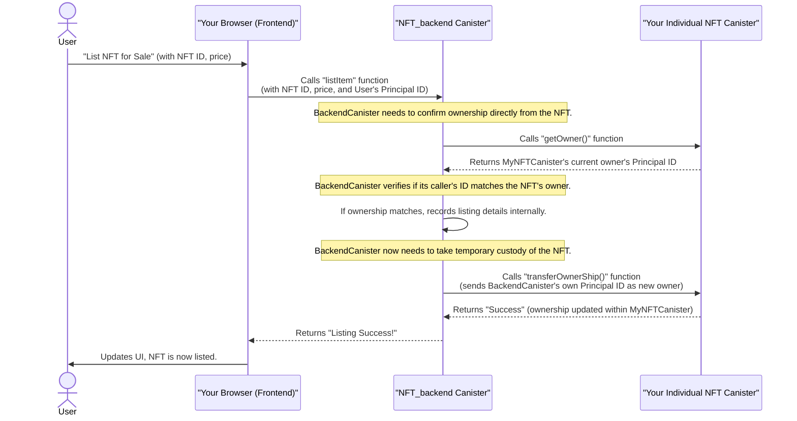

# Chapter 5: Inter-Canister Communication

In the last chapter, [NFT_backend Canister (Marketplace Logic)](04_nft_backend_canister__marketplace_logic_.md), we learned that our `NFT_backend` canister acts as the central brain of our NFT marketplace, coordinating everything from minting to selling. But how does this central brain talk to all the other parts of our application? How does it tell an individual [NFT Actor Class (Individual NFT Canister)](03_nft_actor_class__individual_nft_canister__.md) to change its owner, or get a list of NFTs from the marketplace?

The answer lies in **Inter-Canister Communication**.

Imagine a company where different departments handle different tasks: the Sales Department finds new customers, the Production Department builds products, and the Shipping Department sends them out. For the company to function, these departments need to talk to each other constantly. "Sales, we got a new order!" "Production, build this!" "Shipping, send this product to that address!"

On the Internet Computer, our canisters are like these independent departments. Each canister is a self-contained program ([ICP Canisters (Smart Contracts)](02_icp_canisters__smart_contracts__.md)), but they rarely work completely alone. They need to communicate to build a complex, decentralized application like our NFT marketplace.

---

### What is Inter-Canister Communication?

Inter-Canister Communication is the secure, direct, and on-chain way for different smart contracts (canisters) on the Internet Computer to **call functions on each other**.

Instead of relying on traditional web APIs (like making an HTTP request to an external server), canisters can directly invoke public functions of other canisters that live on the same blockchain. This is fundamental for building truly decentralized applications because all communication happens *within* the blockchain network itself, making it highly secure and tamper-proof.

Here's why it's so powerful for our NFT Marketplace:

1.  **Frontend Canister ↔ NFT_backend Canister**: Your browser (talking to the [NFT_frontend](02_icp_canisters__smart_contracts__.md) canister) needs to fetch data (like your owned NFTs or listed NFTs) or trigger actions (like minting a new NFT or listing one for sale) from the `NFT_backend` canister.
2.  **NFT_backend Canister ↔ Individual NFT Canisters**: The `NFT_backend` (marketplace coordinator) needs to interact with individual NFT canisters. For example, to check who owns a specific NFT before listing it, or to transfer its ownership after a sale.

This direct communication is like sending a secure, internal memo between departments, where each memo is guaranteed to be delivered and acted upon by the correct recipient on the blockchain.

---

### How Canisters "Call" Each Other (The Concept)

Think of each canister as having a public "interface" – a list of functions that other canisters are allowed to call. When one canister wants to talk to another, it simply "calls" one of these public functions, just like you might call a function within the same program. The Internet Computer network ensures that this call is securely routed and executed by the target canister.

Crucially, when a canister makes a call to another canister, the `msg.caller` (the [Principal ID (Identity)](01_principal_id__identity__.md) of the entity making the call) within the *receiving* canister will be the Principal ID of the *calling canister*, not the original user. This allows canisters to perform actions on behalf of users securely.

---

### Inter-Canister Communication in Action: Listing an NFT

Let's revisit the process of listing an NFT for sale, which we touched upon in the [NFT_backend Canister (Marketplace Logic)](04_nft_backend_canister__marketplace_logic_.md) chapter. This is a perfect example of inter-canister communication.

When you, as a user, decide to list your NFT for sale:

1.  Your **Frontend** (browser) calls a function on the **`NFT_backend`** canister.
2.  The **`NFT_backend`** canister then needs to talk to *your specific* **Individual NFT Canister** to verify that you are indeed the owner and to transfer the NFT's ownership to the marketplace.

This sequence involves calls between three different entities (frontend, `NFT_backend`, and your individual NFT).

Here's a simplified view of the interaction:



In this diagram, the calls from `BackendCanister` to `MyNFTCanister` are the core of **inter-canister communication**.

---

### Code Examples: Making Inter-Canister Calls

Let's look at how these calls are made in our project's Motoko and JavaScript code.

#### 1. Motoko: `NFT_backend` Calling an Individual NFT Canister

In Motoko, when `NFT_backend` needs to talk to an individual NFT canister, it first gets a "reference" to that specific NFT canister using its [Principal ID (Identity)](01_principal_id__identity__.md).

Here's the simplified `listItem` function from `src/NFT_backend/main.mo`, focusing on the inter-canister calls:

```motoko
// --- File: src/NFT_backend/main.mo (Simplified) ---
// ... (imports) ...
import NFTActorClass "../Canister/canister"; // Imports the blueprint for NFT canisters

actor NftMarketPlace {
  // mapOfNFTs stores references to all deployed NFT canisters
  var mapOfNFTs = HashMap.HashMap<Principal, NFTActorClass.NFT>(...);
  // ... (other marketplace logic) ...

  public shared(msg) func listItem(id: Principal, price: Nat): async Text{
    // 1. Get a reference to the specific NFT canister using its 'id'
    // 'item' is now an "actor" that can call functions on that NFT canister
    var item: NFTActorClass.NFT = switch (mapOfNFTs.get(id)){
      case null return "NFT does not exists";
      case (?result) result;
    };

    // 2. INTER-CANISTER CALL: Ask the individual NFT canister for its current owner
    let owner = await item.getOwner(); // Calls getOwner() on 'item' canister

    // ... (logic to check if msg.caller == owner) ...

    // 3. INTER-CANISTER CALL: Transfer ownership of the NFT to the marketplace canister
    let Market_ID = Principal.fromActor(this); // Get the Principal ID of THIS NFT_backend canister
    let transferResult = await item.transferOwnerShip(Market_ID); // Calls transferOwnerShip() on 'item' canister

    // ... (handle result and record listing) ...
    return "Success";
  };
  // ... (other functions) ...
};
```
**Explanation:**
*   `var item: NFTActorClass.NFT = switch (mapOfNFTs.get(id))`: This line retrieves an `actor` reference to the specific NFT canister using its unique `Principal ID` (`id`). Think of `item` as a remote control for that specific NFT canister.
*   `await item.getOwner()`: This is the first inter-canister call. The `NFT_backend` canister calls the `getOwner()` function on the `item` (the individual NFT canister). The `await` keyword means the `NFT_backend` will pause and wait for the `item` canister to respond with the owner's [Principal ID (Identity)](01_principal_id__identity__.md).
*   `await item.transferOwnerShip(Market_ID)`: This is another crucial inter-canister call. After verifying ownership, the `NFT_backend` calls `transferOwnerShip()` on the `item` canister, telling it to set its new owner to the `NFT_backend`'s own `Principal ID` (`Market_ID`). This makes the marketplace temporarily hold the NFT while it's listed for sale.

#### 2. JavaScript: Frontend Calling the `NFT_backend` or an Individual NFT Canister

Our React frontend, running in your browser, is also a canister (`NFT_frontend`). It communicates with other canisters using DFINITY's JavaScript agent library.

##### Frontend calling `NFT_backend` (e.g., to mint an NFT):

```jsx
// --- File: src/NFT_frontend/components/Minter.jsx (Simplified) ---
import { NFT_backend } from "../../declarations/NFT_backend"; // Imports the client for NFT_backend

function Minter() {
  // ... (state and form setup) ...

  async function onSubmit(data) {
    // ... (get image and name data) ...

    // INTER-CANISTER CALL: Frontend calls the mint function on the NFT_backend canister
    const newNFTID = await NFT_backend.mint(imageByteData, name);
    
    console.log("Newly minted NFT ID:", newNFTID.toString());
    // ... (update UI) ...
  }
  // ... (render component) ...
}
export default Minter;
```
**Explanation:**
*   `import { NFT_backend } from "../../declarations/NFT_backend";`: This line imports a special JavaScript object (`NFT_backend`) that acts as a client for our `NFT_backend` canister. It's automatically generated by `dfx` based on the `NFT_backend`'s Motoko code.
*   `await NFT_backend.mint(imageByteData, name)`: This is a direct call from the frontend to the `mint` function on the `NFT_backend` canister. The frontend waits for the backend to complete the minting process and return the [Principal ID (Identity)](01_principal_id__identity__.md) of the newly created NFT.

##### Frontend calling an Individual NFT Canister (e.g., to display its details):

```jsx
// --- File: src/NFT_frontend/components/Item.jsx (Simplified) ---
import { Actor, HttpAgent } from "@dfinity/agent";
import { idlFactory } from "../../declarations/Canister"; // IDL for our NFT blueprint

function Item(props) {
  // ... (state and setup) ...
  const id = props.id; // The Principal ID of THIS specific NFT canister

  async function loadNFT() {
    // ... (agent setup) ...

    // 1. Create an 'Actor' to communicate with the specific NFT canister
    let NFTActor = Actor.createActor(idlFactory, {
      agent,
      canisterId: id, // We tell it *which* specific NFT canister ID to talk to
    });

    // 2. INTER-CANISTER CALL: Call the public methods on that specific NFT canister
    const nameData = await NFTActor.getName();    // Calls getName() on the NFT
    const ownerData = await NFTActor.getOwner();  // Calls getOwner() on the NFT
    const assetData = await NFTActor.getAsset();  // Calls getAsset() on the NFT

    // ... (process and display data) ...
  }
  // ... (render component) ...
}
export default Item;
```
**Explanation:**
*   `Actor.createActor(idlFactory, { agent, canisterId: id });`: Since each NFT is a *separate* canister with a unique `id`, we need to dynamically create a client (an "actor") for *that specific* NFT canister. `idlFactory` describes the functions the NFT canister has.
*   `await NFTActor.getName()`: Once `NFTActor` is created for a specific NFT, we can then directly call its public functions like `getName()`, `getOwner()`, and `getAsset()` to fetch its unique data.

---

### Benefits of Inter-Canister Communication

1.  **True Decentralization**: The entire application, from frontend to backend to individual assets, lives and communicates on the blockchain. No external centralized servers are involved in the core logic.
2.  **Enhanced Security**: All calls are cryptographically secured and verified by the Internet Computer network. The identity of the calling canister (`msg.caller`) is guaranteed.
3.  **Scalability**: The Internet Computer's architecture allows for complex applications to be broken down into many communicating canisters, which can be scaled independently across subnets.
4.  **Atomicity**: Inter-canister calls can be part of atomic transactions, meaning either all steps succeed, or none do, ensuring data consistency.

---

### Conclusion

Inter-Canister Communication is the glue that holds our decentralized NFT marketplace together. It allows our different canisters—the frontend, the marketplace backend, and each individual NFT—to interact directly and securely on the Internet Computer blockchain. This powerful abstraction makes it possible to build complex, fully on-chain applications that are resilient, transparent, and secure.

Now that we've seen how all the pieces of our marketplace communicate, let's look at the toolkit that helps us build, deploy, and manage these canisters: the DFX SDK.

[DFX SDK (Development Toolchain)](06_dfx_sdk__development_toolchain_.md)

---
