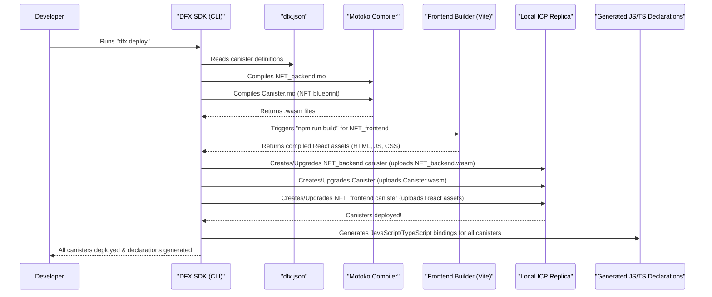

# Chapter 6: DFX SDK (Development Toolchain)

In our journey so far, we've explored the fundamental building blocks of our NFT marketplace: from understanding **who** is interacting (your [Principal ID (Identity)](01_principal_id__identity__.md)), to **what** they are interacting with (our [ICP Canisters (Smart Contracts)](02_icp_canisters__smart_contracts__.md), including the unique [NFT Actor Class (Individual NFT Canister)](03_nft_actor_class__individual_nft_canister__.md) and the orchestrating [NFT_backend Canister (Marketplace Logic)](04_nft_backend_canister__marketplace_logic_.md)), and finally, **how** these pieces talk to each other through [Inter-Canister Communication](05_inter_canister_communication_.md).

Now, let's zoom out and consider the bigger picture: How do we actually *build* all these pieces? How do we turn our Motoko code into running smart contracts? How do we get our React frontend code deployed alongside them? And how do we connect everything so it works together seamlessly on the Internet Computer?

This is where the **DFX SDK (Development Toolchain)** comes in. Think of DFX as your all-in-one magical workbench for building applications on the Internet Computer. It's the essential toolkit that handles all the heavy lifting, letting you focus on writing your application logic instead of wrestling with deployment complexities.

---

### What is DFX SDK?

DFX is Dfinity's official **D**evelopment **F**ramework for the Internet Computer. It's a powerful command-line interface (CLI) and a comprehensive Software Development Kit (SDK) rolled into one. It's designed to make the entire process of developing, deploying, and managing applications on the Internet Computer as straightforward as possible.

Here are the main problems DFX solves for us:

1.  **Project Setup**: Getting a new Internet Computer project started.
2.  **Canister Management**: Creating, deploying, and managing your canisters (smart contracts and frontends).
3.  **Code Compilation**: Turning your Motoko code into WebAssembly (Wasm), which is what canisters run.
4.  **Local Testing**: Running a mini-version of the Internet Computer right on your own machine.
5.  **Frontend Integration**: Automatically generating code that lets your frontend easily talk to your backend canisters.
6.  **Deployment**: Pushing your entire application to the live Internet Computer blockchain.

Without DFX, building ICP applications would be like trying to build a house without any power tools – possible, but incredibly difficult and time-consuming.

---

### DFX in Action: Deploying Our NFT Marketplace

Let's look at the most common and powerful DFX command you'll use: `dfx deploy`.

This single command tells DFX: "Hey, take my entire project, compile everything, and put it on the Internet Computer (or my local replica)."

When you run `dfx deploy` in our NFT marketplace project, DFX orchestrates a series of crucial steps:

1.  **Reads `dfx.json`**: It starts by looking at your `dfx.json` file, which is like the project's blueprint. This file tells DFX about all the canisters in your project (e.g., `NFT_backend`, `Canister`, `NFT_frontend`), what type of code they contain (Motoko or assets), and where their source files are located. (We briefly touched upon this in [ICP Canisters (Smart Contracts)](02_icp_canisters__smart_contracts__.md)).
2.  **Compiles Motoko Canisters**: For `NFT_backend` and `Canister` (our individual NFT blueprint), DFX uses the Motoko compiler to turn your human-readable Motoko code (`.mo` files) into highly efficient WebAssembly (Wasm) bytecode, which is what the Internet Computer understands.
3.  **Builds Frontend Assets**: For `NFT_frontend`, DFX understands it's an "assets" canister. It will often trigger a build process (like `npm run build` for our React app) to compile your React code, CSS, and images into static files ready for deployment.
4.  **Creates & Installs Canisters**: If it's the first deployment, DFX creates new, empty canisters on the Internet Computer network (or your local replica) and then uploads the compiled Wasm and assets into them. If canisters already exist, it upgrades them with the new code.
5.  **Generates Frontend Bindings**: This is a super cool feature! DFX automatically generates special JavaScript/TypeScript code (known as Candid bindings) that allows your React frontend to *easily* call the functions of your Motoko backend canisters. These generated files live in the `src/declarations` folder and abstract away much of the complexity of [Inter-Canister Communication](05_inter_canister_communication_.md) from your frontend code.
6.  **Links Dependencies**: DFX ensures that canisters that depend on each other (like `NFT_frontend` depending on `NFT_backend`) are correctly configured to communicate.

---

### DFX Workflow: A Visual Guide

Let's visualize the magic of `dfx deploy`:


This diagram shows how `dfx deploy` acts as a central coordinator, automating the entire build and deployment process.

---

### DFX Configuration: The `dfx.json` File

The `dfx.json` file is your project's manifest. It's how you tell DFX about all the different parts (canisters) of your application.

Here’s a simplified look at our `dfx.json` and what each part tells DFX:

```json
// --- File: dfx.json (simplified) ---
{
  "canisters": {
    "NFT_backend": {
      "main": "src/NFT_backend/main.mo",
      "type": "motoko"
    },
    "Canister":{
      "main": "src/Canister/canister.mo",
      "type": "motoko"
    },
    "NFT_frontend": {
      "dependencies": [
        "NFT_backend"
      ],
      "source": [
        "src/NFT_frontend/dist"
      ],
      "type": "assets",
      "workspace": "NFT_frontend"
    }
  },
  "output_env_file": ".env",
  "version": 1
}
```

*   `"canisters"`: This section lists all the individual canisters in your project. Each key (like `"NFT_backend"`, `"Canister"`, `"NFT_frontend"`) is the name you give to that canister.
*   `"main": "src/NFT_backend/main.mo"`: For Motoko canisters, `main` points to the primary Motoko source file. DFX knows to compile this file.
*   `"type": "motoko"`: This tells DFX to use the Motoko compiler for this canister.
*   `"type": "assets"`: This tells DFX that `NFT_frontend` is a frontend canister that will serve static files (like your compiled React app) directly to a web browser.
*   `"source": ["src/NFT_frontend/dist"]`: For asset canisters, this specifies where DFX can find the files (HTML, JS, CSS, images) that need to be uploaded and served. `src/NFT_frontend/dist` is where our React `vite build` command puts its output.
*   `"dependencies": ["NFT_backend"]`: This is very important for [Inter-Canister Communication](05_inter_canister_communication_.md)! It tells DFX that `NFT_frontend` needs to know about `NFT_backend`. When DFX generates the JavaScript bindings, it will include information about `NFT_backend` so the frontend can easily call its functions.
*   `"output_env_file": ".env"`: DFX can output canister IDs to an `.env` file, which is useful for frontend development to dynamically connect to the correct canisters.

---

### DFX and Frontend Development (Generated Declarations)

One of DFX's most developer-friendly features is its automatic generation of client-side bindings. After you deploy your Motoko canisters, DFX creates JavaScript/TypeScript files in a `declarations` folder (e.g., `src/declarations/NFT_backend/index.js`, `src/declarations/NFT_backend/NFT_backend.did.js`).

These files act as a bridge, allowing your React frontend (written in JavaScript/TypeScript) to easily interact with your Motoko smart contracts. They abstract away the complex details of how `msg.caller` and Candid (the Internet Computer's Interface Description Language) work.

For example, when our `Minter.jsx` calls `NFT_backend.mint()`, it's actually using the client code generated by DFX:

```jsx
// --- File: src/NFT_frontend/components/Minter.jsx (Simplified) ---
import { NFT_backend } from "../../declarations/NFT_backend"; // DFX-generated client for NFT_backend

function Minter() {
  // ...
  async function onSubmit(data) {
    // ...
    // Calling the backend canister's mint function using the DFX-generated client
    const newNFTID = await NFT_backend.mint(imageByteData, name);
    // ...
  }
  // ...
}
export default Minter;
```
The `import { NFT_backend } from "../../declarations/NFT_backend";` line is importing the code DFX generated. This means you don't have to write the low-level code to send requests to `NFT_backend`; DFX does it for you!

---

### Essential DFX Commands

While `dfx deploy` is your primary command, here are a few other DFX commands you'll frequently use:

| Command                               | Description                                                                                                                                                                                                                                                                |
| :------------------------------------ | :------------------------------------------------------------------------------------------------------------------------------------------------------------------------------------------------------------------------------------------------------------------------- |
| `dfx start --clean --background`      | Starts a **local replica** of the Internet Computer in the background. `--clean` wipes any previous local data, giving you a fresh start. This is crucial for local development and testing without affecting the live network.                                             |
| `dfx stop`                            | Stops the local replica.                                                                                                                                                                                                                                                   |
| `dfx canister create <canister_name>` | Creates a new, empty canister on the network. `dfx deploy` often does this automatically if a canister doesn't exist.                                                                                                                                                      |
| `dfx canister install <canister_name>`| Installs the compiled Wasm module into an existing empty canister. `dfx deploy` also handles this.                                                                                                                                                                         |
| `dfx generate`                        | Manually triggers the generation of JavaScript/TypeScript bindings for all your canisters. Often run as a `prebuild` step for frontends. (See `package.json` `prebuild` script).                                                                                             |
| `dfx canister call <canister_name> <method_name> '(<args>)'` | Allows you to directly call a public function on a deployed canister from your command line. Great for testing backend functions without the frontend. For example: `dfx canister call NFT_backend getListedNFTIds` |
| `dfx canister id <canister_name>`     | Retrieves the unique [Principal ID (Identity)](01_principal_id__identity__.md) of a deployed canister.                                                                                                                                                                      |
| `dfx identity get-principal`          | Displays your currently active [Principal ID (Identity)](01_principal_id__identity__.md) that DFX is using to authenticate your commands.                                                                                                                                  |

Our `package.json`'s `scripts` section also demonstrates how DFX commands are integrated into the overall development workflow:

```json
// --- File: src/NFT_frontend/package.json (simplified) ---
{
  // ...
  "scripts": {
    "setup": "npm i && dfx canister create NFT_backend && dfx generate NFT_backend && dfx deploy",
    "start": "vite --port 3000",
    "prebuild": "dfx generate", // DFX runs 'dfx generate' BEFORE 'npm run build'
    "build": "tsc && vite build",
    // ...
  },
  // ...
}
```
Notice `dfx generate` is part of `prebuild`, meaning it ensures your frontend always has the latest client bindings before your React app is compiled.

---

### Conclusion

The DFX SDK is the unsung hero of Internet Computer development. It provides the essential toolkit that abstracts away much of the complexity, allowing us to seamlessly compile our Motoko smart contracts, build our React frontend, manage our canisters, and deploy our entire decentralized NFT marketplace, either locally or to the live Internet Computer. It's the workbench that brings all our theoretical concepts—from Principal IDs to inter-canister communication—into a working, interactive application.

Now that you understand all the core concepts behind our NFT marketplace, you're ready to dive into the code and see how these pieces fit together to create a fully decentralized digital art gallery!

---
