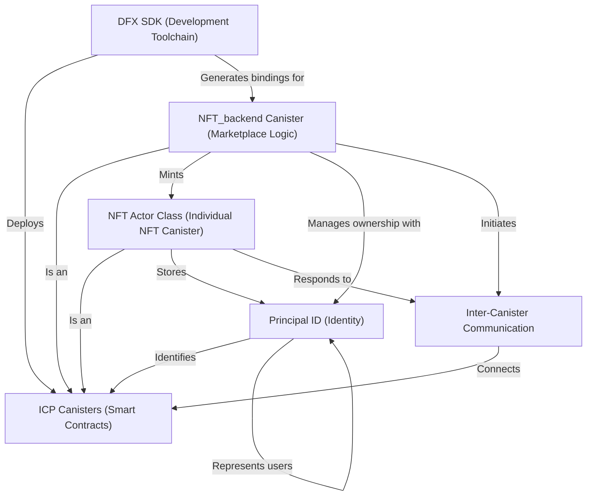

[skip to quick start](00_quick_overview.md)

# NFT-Market-Place

This project is an **NFT Marketplace** built on the *Internet Computer Protocol (ICP)* blockchain. It allows users to **mint unique NFTs**, where each NFT is its own *self-contained smart contract*, list them for sale, and discover or purchase NFTs from others. The entire application, including both the *frontend and backend logic*, runs directly on the blockchain as interconnected smart contracts called *canisters*, ensuring a truly decentralized experience.

## Visual Overview

## Chapters

1. [Principal ID (Identity)
](01_principal_id__identity__.md)
2. [ICP Canisters (Smart Contracts)
](02_icp_canisters__smart_contracts__.md)
3. [NFT Actor Class (Individual NFT Canister)
](03_nft_actor_class__individual_nft_canister__.md)
4. [NFT_backend Canister (Marketplace Logic)
](04_nft_backend_canister__marketplace_logic__.md)
5. [Inter-Canister Communication
](05_inter_canister_communication_.md)
6. [DFX SDK (Development Toolchain)
](06_dfx_sdk__development_toolchain__.md)

---
